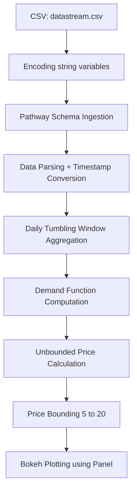

# Dynamic Parking Pricing Using Real-Time Demand Modeling

## Overview

This project was developed as part of the **Summer Analytics 2025**, organised by Consulting & Analytics Club of IIT Guwahati. 
In Model 2, I implemented a real-time pricing algorithm that adjusts the daily parking price based on calculated demand using various influencing factors. The model mimics nonlinear market behavior and applies bounded pricing between a minimum and maximum threshold.

---

## Tech Stack

- **Python**: Core programming language
- [**Pathway**](https://pathway.com/): Real-time data processing and temporal windowing
- **Pandas**: CSV preprocessing
- **Bokeh**: Interactive plotting and visualizations
- **Panel**: Dashboard integration
- **Google Colab**: .ipynb Development and documentation

---

## Architecture Diagram

---

## Project Architecture & Workflow

### 1. **Data Ingestion**

- The raw data containing fields like `Timestamp`, `Occupancy`, `Capacity`, `QueueLength`, `VehicleType`, `IsSpecialDay`, and `TrafficConditionNearby` is encoded from string to integers, then relevant data is streamed into the system using `pw.demo.replay_csv()` from Pathway.

### 2. **Time Conversion & Partitioning**

- The timestamp string is converted into datetime format.
- A daily key (`day_str`) is extracted for windowing purposes.
- Such that the model calculates price per day and not on a half-hourly basis

### 3. **Temporal Windowing**

- Using Pathway's `.windowby(...)`, the data is grouped by day into fixed 1-day tumbling windows.
- This will compute daily summaries of metrics like occupancy, traffic, and queue length.

### 4. **Demand Modeling**

- A nonlinear demand function is calculated based on:
  - Occupancy range (occ_max - occ_min)
  - Occupancy spike factor (occ_max / occ_min)
  - QueueLength (normalized)
  - VehicleType (treated as ordinal, normalized)
  - TrafficConditionNearby (centered at zero)
  - IsSpecialDay (alters weights and curve shape)

### 5. **Price Generation**

- Demand is passed into a linear multiplier to get an `unbounded_price`.
- This value is clipped between 5 and 20 using `apply_with_type()`.

### 6. **Visualization**

- The final prices are visualized in a time-series line chart using **Bokeh** and **Panel**.
- Each dot represents a day; the line captures pricing trends.

---

## How to Run

1. Clone the repository
2. Launch Jupyter Notebook and run `Krish_Sandhu_SA2025_Project.ipynb`
3. Run cells as per instructions given in the file to stream and visualize prices in real time

